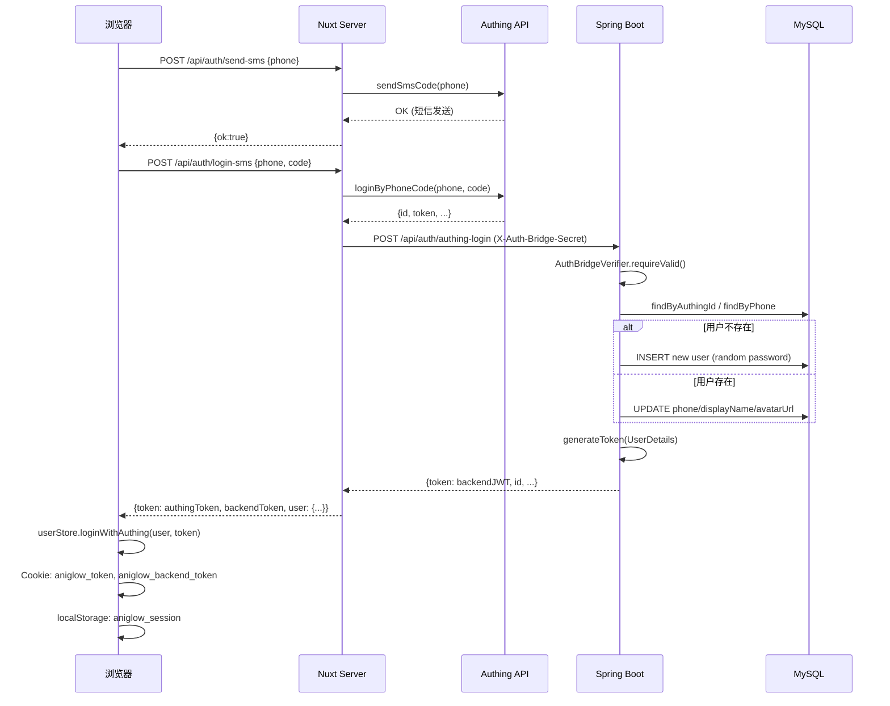
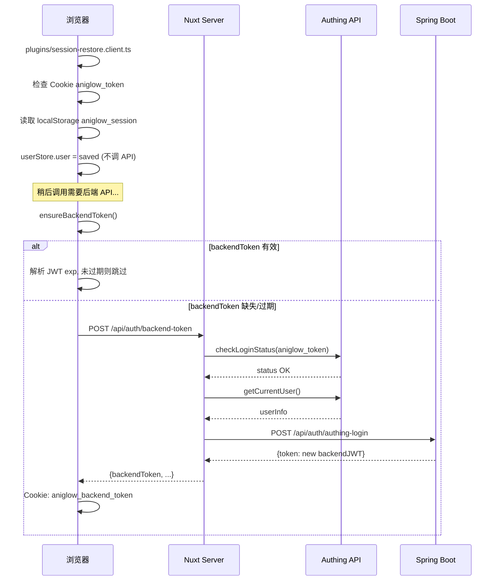
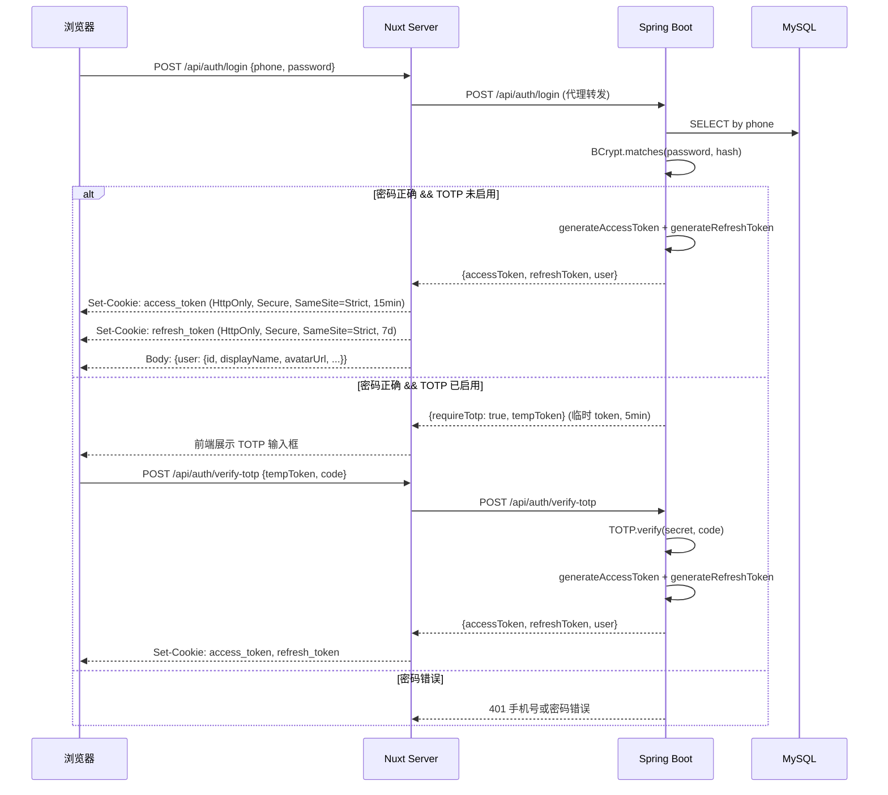
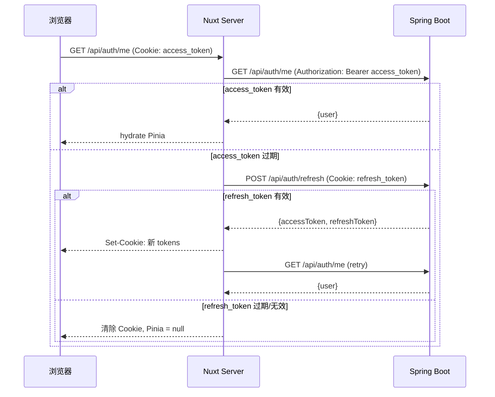
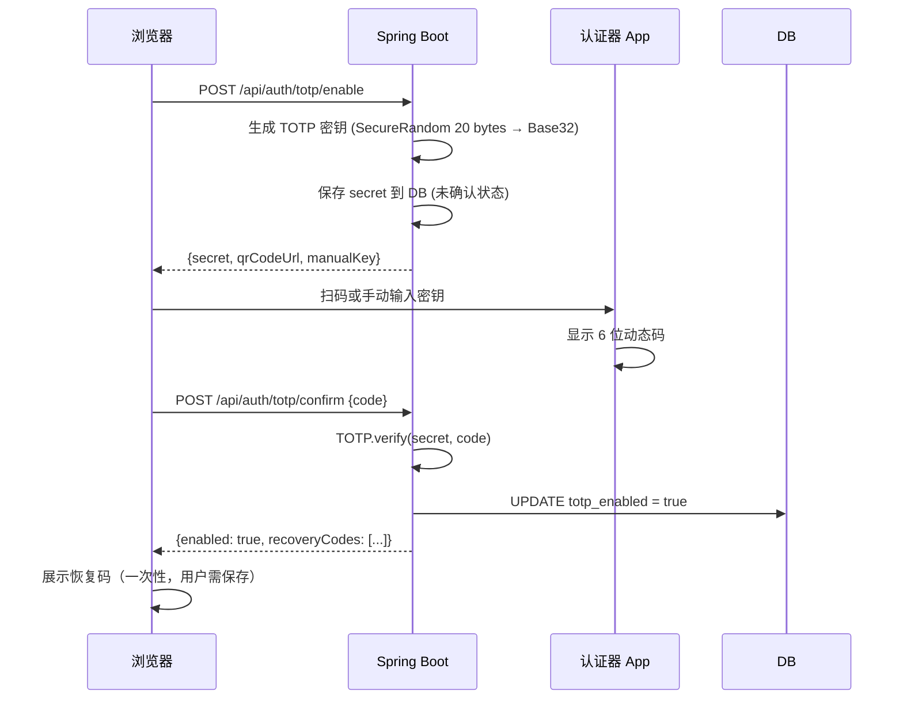
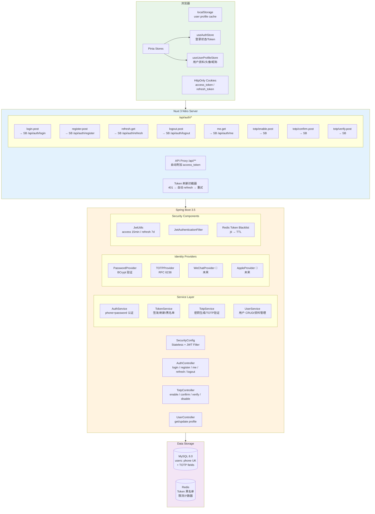

# 萤火番舍 AniGlow — 认证与用户身份系统重构设计文档

> 版本: v1.2 | 日期: 2026-07-19 | 作者: 架构审计 | 状态: 用户名密码阶段已实施

> **产品决策补充（优先于下文原方案）：** 当前阶段不使用付费短信。主登录标识改为唯一用户名，手机号仅作为未来可选、待验证资料；新用户使用用户名和密码注册登录。TOTP、短信找回和邮箱登录延期。旧 Authing 账户只保留无短信的会话迁移通道，登录后必须设置本地用户名和密码，迁移完成后删除 Authing。`authing_id` 继续保持唯一，生产 Cookie 在 HTTPS 完成后启用 `Secure`。

> **本阶段实施结果：** 已移除短信发送、短信登录、Authing Guard/OIDC 新登录入口；新增本地注册登录、15 分钟 Access Token、7 天 Refresh Token、令牌用途隔离、刷新轮换与退出撤销。Nuxt 使用 `HttpOnly + SameSite=Lax` Cookie 并自动刷新，Pinia 不再保存 Token，写接口增加跨站来源校验。旧 Authing Cookie 仅保留一次性无短信迁移能力。手机号验证、账号找回、TOTP 与 HTTPS `Secure` Cookie 属于后续有经费阶段。

---

## 1. 当前认证架构概览

### 1.1 系统拓扑

```
┌──────────────────────────────────────────────────────────────────┐
│  浏览器                                                           │
│  ├─ localStorage: aniglow_session, aniglow_profile_*             │
│  ├─ Cookie: aniglow_token (Authing), aniglow_backend_token (JWT) │
│  └─ Pinia useUserStore: user, token, backendToken, backendUserId │
└──────────────────────────────┬───────────────────────────────────┘
                               │ HTTPS
┌──────────────────────────────▼───────────────────────────────────┐
│  Nuxt 3 (Nitro) SSR + API Proxy                                  │
│  ├─ /api/auth/login-sms    → Authing SDK → exchangeBackendToken  │
│  ├─ /api/auth/login-password → Authing SDK → exchangeBackendToken│
│  ├─ /api/auth/register     → Authing SDK → exchangeBackendToken  │
│  ├─ /api/auth/callback     → Authing OIDC → exchangeBackendToken │
│  ├─ /api/auth/backend-token → Authing validate → exchangeToken   │
│  ├─ /api/auth/send-sms     → Authing SDK                         │
│  └─ /api/auth/me           → Authing OIDC /me                    │
│                                                                   │
│  exchangeBackendToken():                                          │
│    POST {backend}/api/auth/authing-login                          │
│      Header: X-Auth-Bridge-Secret (共享密钥)                       │
│      Body: { authingId, username, email, phone, avatarUrl }       │
└──────────────────────────────┬───────────────────────────────────┘
                               │ WireGuard / Docker Network
┌──────────────────────────────▼───────────────────────────────────┐
│  Spring Boot 3.5 (context-path: /api)                            │
│  ├─ AuthBridgeVerifier.requireValid(bridgeSecret)                │
│  ├─ AuthService.authingLogin()                                    │
│  │   ├─ findAuthingUser(): by authingId → by phone → by username │
│  │   └─ createAuthingUser(): new User with random password       │
│  ├─ JwtUtils: generateToken / generateRefreshToken               │
│  ├─ JwtAuthenticationFilter: Bearer token → SecurityContext      │
│  └─ AuthService.login/register: username/password                │
└──────────────────────────────┬───────────────────────────────────┘
                               │
┌──────────────────────────────▼───────────────────────────────────┐
│  MySQL 8.0                                                       │
│  users: UK(username, email, phone, authing_id)                   │
│  ratings, community_posts, community_replies, firefly_votes ...   │
│  All FK → users(id)                                              │
└──────────────────────────────────────────────────────────────────┘
```

### 1.2 当前 Token 流转

| Token 类型 | 签发者 | 存储位置 | 生命周期 | 用途 |
|-----------|--------|---------|---------|------|
| Authing Token (id_token/access_token) | Authing OIDC | Cookie `aniglow_token` | Authing 决定 | Authing SDK 会话恢复 |
| 后端 JWT (access) | Spring Boot JwtUtils | Cookie `aniglow_backend_token` | 24h | 后端 API 鉴权 |
| 后端 JWT (refresh) | Spring Boot JwtUtils | 未使用 | 7d | 设计存在但从未颁发给 Authing 登录流 |
| 用户会话 | Pinia + localStorage | `aniglow_session` | 无限制 | 页面刷新后恢复 UI 状态 |

### 1.3 当前用户实体

文件: `aniglow-backend/src/main/java/com/aniglow/entity/User.java:12-72`

```java
@Entity @Table(name = "users")
public class User {
    @Id @GeneratedValue(strategy = GenerationType.IDENTITY)
    private Long id;
    
    @Column(nullable = false, unique = true, length = 50)
    private String username;     // 手机号 或 "auth_" + authingId
    
    @Column(nullable = false, unique = true, length = 100)
    private String email;        // 手机号@authing.user 或 UUID@authing.user
    
    @Column(nullable = false)
    private String password;     // BCrypt(随机UUID) 用于 Authing 用户
    
    @Column(unique = true, length = 20)
    private String phone;        // 真实手机号，可为 null
    
    @Column(length = 80)
    private String displayName;  // 展示名称
    
    @Column(columnDefinition = "TEXT")
    private String avatarUrl;    // 头像 URL
    
    @Enumerated(EnumType.STRING) @Column(nullable = false, length = 20)
    private Role role;           // USER, ADMIN, MODERATOR
    
    @Column(unique = true, length = 100)
    private String authingId;    // Authing 用户 ID
    
    // timestamps: createdAt, updatedAt, lastLoginAt, isActive
}
```

数据库唯一索引 (V1__baseline_schema.sql:16-19):
```sql
UNIQUE KEY uk_users_username (username),
UNIQUE KEY uk_users_email (email),
UNIQUE KEY uk_users_phone (phone),
UNIQUE KEY uk_users_authing_id (authing_id)
```

### 1.4 前端认证状态

文件: `stores/user.ts:13-35`

```typescript
// 两个 Cookie（30 天，secure=false，无 HttpOnly）
const token = useCookie('aniglow_token', { maxAge: 60*60*24*30, secure: false })
const backendToken = useCookie('aniglow_backend_token', { maxAge: 60*60*24*30, secure: false })

// 会话数据持久化到 localStorage
const SESSION_KEY = 'aniglow_session'  // User 对象
const PROFILE_PREFIX = 'aniglow_profile_'  // 按 phone/id 分 key
```

---

## 2. 登录流程 Mermaid 时序图

### 2.1 当前流程 — 手机验证码登录（Authing 路径，将被移除）



### 2.2 当前流程 — 页面刷新恢复登录



### 2.3 目标流程 — 手机号密码 + TOTP 登录



### 2.4 目标流程 — 页面刷新恢复登录



### 2.5 目标流程 — TOTP 首次启用



---

## 3. 数据模型和身份映射关系

### 3.1 当前问题：三套身份混用

```
 Authing ID ──────────┐
 (stores/user.ts:155  │  user.value.id = String(authingUser?.id)
  用作前端 User.id)   │
                      │
 Authing ID ──────────┤
 (User.java:67        │  user.authingId (唯一索引)
  后端绑定字段)        │
                      │
 本地数据库 ID ────────┤
 (User.java:23        │  user.id (自增主键)
  FK 关联的业务 ID)    │  ← 正确的业务身份，但前端不用它
                      │
 手机号 ──────────────┘
 (User.java:34        │  user.phone (唯一索引)
  本应是唯一自然人标识)
```

### 3.2 目标数据模型

```sql
-- V4__refactor_authentication.sql

-- 添加 TOTP 字段
ALTER TABLE users
  ADD COLUMN totp_secret VARCHAR(64) NULL COMMENT 'Base32 编码的 TOTP 密钥',
  ADD COLUMN totp_enabled TINYINT(1) NOT NULL DEFAULT 0 COMMENT 'TOTP 是否已确认启用',
  ADD COLUMN totp_confirmed_at DATETIME NULL COMMENT 'TOTP 确认时间',
  ADD COLUMN recovery_codes VARCHAR(512) NULL COMMENT 'BCrypt 哈希的恢复码，逗号分隔';

-- authingId 保留但移除唯一约束（兼容旧数据，不再强制唯一）
ALTER TABLE users
  DROP INDEX uk_users_authing_id,
  ADD INDEX idx_users_authing_id (authing_id);

-- 改为可选字段
-- email 允许 NULL（不再强制每个用户有邮箱）
ALTER TABLE users
  MODIFY COLUMN email VARCHAR(100) NULL;

-- 废弃字段（不删除，避免影响旧数据查询）
-- username: 改为非唯一（不再用于登录），实际用 phone 做主标识
ALTER TABLE users
  DROP INDEX uk_users_username,
  ADD INDEX idx_users_username (username);
```

### 3.3 目标实体字段

```java
@Entity @Table(name = "users")
public class User {
    @Id @GeneratedValue(strategy = GenerationType.IDENTITY)
    private Long id;                    // ← 唯一业务身份，所有 FK 指向此字段

    @Column(unique = true, length = 20)
    private String phone;               // ← 自然人唯一标识，必须唯一 NOT NULL

    @Column(nullable = false)
    private String password;            // BCrypt 哈希的真实密码

    @Column(length = 80)
    private String displayName;         // 展示昵称（仅首次注册初始化）

    @Column(columnDefinition = "TEXT")
    private String avatarUrl;           // 头像 URL（仅首次注册初始化）

    @Column(length = 100)
    private String email;               // 可选（未来增加邮箱登录时使用）

    @Column(length = 100)
    private String authingId;           // 已废弃：仅保留用于旧数据追踪，无唯一约束

    // TOTP 字段
    @Column(length = 64)
    private String totpSecret;          // Base32 编码密钥，NULL = 未启用

    private Boolean totpEnabled;        // false = 密钥已生成但未确认，true = 已确认

    @Column(length = 512)
    private String recoveryCodes;       // BCrypt 哈希的恢复码

    // ... role, isActive, timestamps
}
```

### 3.4 身份映射关系（目标）

```
 手机号 (phone) ──── 1:1 ──── 本地用户 (users.id)
                                      │
                    ┌─────────────────┼─────────────────┐
                    ▼                 ▼                  ▼
              ratings.user_id   community_posts     firefly_votes
                                .user_id            .user_id
                                
 所有业务数据 FK → users.id（整数，索引高效）
 前端 User.id = users.id（Number，来自 /api/auth/me 响应）
 昵称/头像实时从 User 实体读取（不冗余存储到业务表）
```

---

## 4. 问题清单（按 P0/P1 排序）

### P0-1: 并发 Authing 回调可创建重复用户

**严重程度:** 严重 — 数据一致性破坏

**证据:**
- `AuthService.java:128-134` — `findAuthingUser()` 先 SELECT，再调用 `createAuthingUser()`
- `AuthService.java:59` — `@Transactional` 但 MySQL REPEATABLE READ 下 SELECT + INSERT 不互斥
- 无 `SELECT ... FOR UPDATE` 或唯一约束兜底（phone 和 authingId 的 UK 是兜底但不够）

**复现条件:**
1. 新用户 A 首次使用手机号 138xxxx 通过 Authing 登录
2. 同时（或极短时间内）在另一个设备/标签页也发起 Authing 登录
3. 两次 `findAuthingUser()` 都返回 empty → 两次 `createAuthingUser()` 执行
4. 可能产生: (a) 两个用户，phone 相同但 UK 冲突 → 第二个 INSERT 报错 / (b) phone 不同但都是同一人 → 数据分裂

**影响:** 重复账户，用户数据分散在两个账户中

**修复方向:** 使用 `INSERT ... ON DUPLICATE KEY UPDATE` 或在 phone 上加唯一锁定

### P0-2: Cookie 安全配置不达标

**严重程度:** 严重 — Token 泄露风险

**证据:**
- `stores/user.ts:19-24`:
```typescript
const token = useCookie<string | null>('aniglow_token', {
  sameSite: 'lax',
  path: '/',
  maxAge: 60 * 60 * 24 * 30,   // 30 天
  secure: false,                // ← HTTP 明文传输
})
```
- `stores/user.ts:30-35`: `backendToken` 同样 `secure: false`
- 两个 Cookie 均未设置 `httpOnly: true`（虽然前端需要读它们，但后端 JWT 不应被 JS 读取）

**影响:** MITM 攻击可窃取 Token；XSS 可直接读取 Token 值

**修复方向:** access_token 设为 HttpOnly + Secure + SameSite=Strict + 15min 过期（由 nitro 服务端设置）；refresh_token 同样 HttpOnly；前端不再直接操作 Token Cookie

### P0-3: 前端 User.id 使用 Authing ID 而非数据库 ID

**严重程度:** 严重 — 身份混乱

**证据:**
- `stores/user.ts:154-155`:
```typescript
const u: User = {
  id: String(authingUser?.id || authingUser?._id || authingUser?.userId || 'authing-user'),
```
- `backendUserId` 虽然存在（`stores/user.ts:27`）但 `useApi.ts` 不依赖它做任何校验
- 业务判断 `isLoggedIn` 不检查 `backendUserId`

**影响:** 前端用 Authing ID 作为用户标识，但所有后端业务数据以 `users.id`（数据库自增）为 FK。两套 ID 不一致，调试和日志混乱。

**修复方向:** 去除 Authing 后，`user.id` 直接使用后端返回的 `users.id`（Number 类型）

### P0-4: Authing 登录可能覆盖用户已清空的资料

**严重程度:** 高 — 用户体验破坏

**证据:**
- `AuthService.java:71-78`:
```java
if (!displayNameResolver.hasText(user.getDisplayName())
        && displayNameResolver.isSafePublicName(request.getUsername(), phone)) {
    user.setDisplayName(request.getUsername().trim());  // ← 覆盖空昵称
    changed = true;
}
if (!displayNameResolver.hasText(user.getAvatarUrl()) && displayNameResolver.hasText(request.getAvatarUrl())) {
    user.setAvatarUrl(request.getAvatarUrl());  // ← 覆盖空头像
    changed = true;
}
```
- 如果用户手动清空了昵称/头像，下次通过 Authing 登录时会被重新填充

**影响:** 用户清空资料后，换设备登录发现资料又回来了

**修复方向:** 区分"从未设置过"和"主动清空"。使用一个 `profile_initialized` 标记或 NULL vs 空字符串区分。

### P0-5: Token 生命周期不一致导致频繁重认证

**严重程度:** 高 — 用户体验差、Authing 费用浪费

**证据:**
- Cookie maxAge: 30 天（`stores/user.ts:22`）
- JWT 过期: 24 小时（`application.yml:118`）
- `ensureBackendToken()` 每次 API 调用前检查 JWT 是否过期（`stores/user.ts:230-236`）
- 过期后调用 `/api/auth/backend-token` → Authing API `checkLoginStatus` + `getCurrentUser` → 产生费用（`backend-token.post.ts:30-33`）

**影响:** 用户每天都可能触发 Authing API 调用，产生不必要的费用；Cookie 和 Token 不同步导致调试困难

**修复方向:** access_token 短（15min），refresh_token 长（7d），自动静默刷新；Cookie 生命周期与服务端一致

### P1-1: 发帖/评分接口接受前端传入的 displayName/avatarUrl 并可覆盖数据库

**严重程度:** 中 — 权限绕过

**证据:**
- `CommunityPostRequest.java:25-29` — `displayName` 和 `avatarUrl` 字段
- `CommunityReplyRequest.java:14-17` — 同上
- `RatingRequest.java:22-26` — 同上
- `CommunityService.java:72` — `userProfileService.syncPublicProfile(user, request.getDisplayName(), request.getAvatarUrl())`
- `UserProfileService.java:15-28` — `syncPublicProfile()` 直接 SET 到 User 实体并 save

**影响:** 用户可以通过发帖/回复/评分接口的参数，修改自己的 displayName 和 avatarUrl，绕过 `/auth/profile` 的正常流程。虽然当前逻辑要求 `isSafePublicName` 校验，但这仍然不应该是发帖接口的职责。

**修复方向:** 从 CommunityPostRequest/RatingRequest 等请求 DTO 中移除 displayName/avatarUrl 字段；用户资料修改统一走 PUT /user/profile。对于发帖，后端从认证上下文读取用户资料。

### P1-2: 退出登录不撤销 JWT

**严重程度:** 中

**证据:**
- `stores/user.ts:212-217` — `logout()` 仅清除前端 Cookie 和 localStorage
- 后端无 Token 黑名单/撤销机制
- JWT 签发后直到自然过期前始终有效

**影响:** 用户退出后，如果 Token 被泄露，仍可被用于 API 调用

**修复方向:** 使用 Redis 维护 JWT 黑名单（jti），TTL 等于 JWT 过期时间；refresh_token 轮转（每次刷新换新 refresh_token，旧 refresh_token 失效）

### P1-3: 无 Identity Provider 抽象

**严重程度:** 中 — 可维护性

**证据:**
- `AuthService.authingLogin()` 直接接收 `AuthingLoginRequest` 并包含 Authing 特定逻辑
- 整个认证流（login-sms, login-password, callback, register）都硬编码 Authing SDK 调用
- 要增加微信/Apple 登录需要复制大量模板代码

**影响:** 扩展新登录方式的成本高、易出错

**修复方向:** 设计 `IdentityProvider` 接口，每个登录方式（password, totp, future: wechat, apple）作为独立实现

### P1-4: SSR hydration 登录状态不一致

**严重程度:** 中

**证据:**
- `stores/user.ts:81-89` — `loadSession()` 有 `import.meta.server` 守卫，SSR 时返回 null
- `plugins/session-restore.client.ts` — 在客户端插件中调用
- 但 `useCookie` 在 SSR 中可以读到 Cookie → SSR 时可能 `token.value` 不为 null 但 `user.value` 为 null
- `isLoggedIn` 要求 `!!user.value && !!token.value` — 所以不会误判"已登录"
- 但 `restoreSession()` 只在客户端调用，SSR 渲染的页面可能显示"未登录"，hydration 后变为"已登录"

**影响:** Hydration mismatch 警告；首屏可能闪烁未登录状态

### P1-5: ensureBackendToken() 可能并发重复请求

**严重程度:** 低

**证据:**
- `stores/user.ts:227-281` — 无 inflight request 去重
- 如果两个组件同时挂载且都调用 `ensureBackendToken()`，会发出两个相同的 POST 请求

**影响:** 浪费一次网络请求，但不影响正确性

### P1-6: 限流器为内存级

**严重程度:** 低（当前单实例部署）

**证据:**
- `RequestRateLimiter.java:17` — `ConcurrentHashMap`
- `request-security.ts:9` — `Map<string, WindowCounter>`
- 进程重启丢失所有限流状态

**影响:** 未来多实例部署时，各实例独立计数，限流失效

### P1-7: UserController 直接注入 Repository

**严重程度:** 低（代码规范）

**证据:**
- `UserController.java:28-29`:
```java
private final UserRepository userRepository;
private final RatingRepository ratingRepository;
```
- Controller 直接调用 `userRepository.findById()`、`userRepository.existsByEmail()`、`userRepository.save()`

**影响:** 违反分层架构，重复逻辑散落

### P1-8: 无审计日志

**严重程度:** 低

**证据:** 登录成功(`AuthService.login`)、注册(`AuthService.register`)、Authing 登录(`AuthService.authingLogin`) 均无审计日志记录

**影响:** 无法追踪异常登录行为

---

## 5. 每个问题的证据、影响范围和复现条件

（已在第 4 节中详细列出，此处不重复）

---

## 6. 已经正确实现、不应重复重构的部分

以下部分经审查确认正确，**在重构中应保留**：

| 组件 | 文件 | 评价 |
|------|------|------|
| JWT 解析与验证 | `JwtUtils.java` | HMAC-SHA256 签名、过期检查、篡改检测均正确，JJWT 0.12.x API 使用规范 |
| 认证过滤器 | `JwtAuthenticationFilter.java` | OncePerRequestFilter 模式正确，错误分类（expired/invalid）到 request attribute |
| AuthBridge 验证 | `AuthBridgeVerifier.java:26-28` | `MessageDigest.isEqual()` 常量时间比较，防止时序攻击 — 优秀 |
| 异常处理 | `GlobalExceptionHandler.java` | 分层异常映射（401/403/404/400/500），不泄露内部细节 |
| X-Forwarded-For 解析 | `ClientIpResolver.java` | 从右向左遍历代理链、可信代理验证、CIDR 支持 — 正确 |
| Nuxt XFF 解析 | `request-security.ts:40-63` | 与后端一致的右向左遍历算法 |
| 业务数据关联 | `CommunityMapper.java:40,45` `RatingMapper.java:19,24` | 所有 DTO 通过 `user.getId()` + `displayNameResolver.resolvePublic(user)` 实时获取展示名 — **这是正确模式** |
| 数据库外键约束 | `V1__baseline_schema.sql` | `ratings.user_id → users.id`、`community_posts.user_id → users.id` 等全部正确 |
| 密码编码 | `SecurityConfig.java:100` | BCryptPasswordEncoder — 正确 |
| 用户资料展示解析 | `UserDisplayNameResolver.java` | `resolvePublic()` 优先级: displayName → username（非手机号）→ "番舍同好" — 逻辑正确 |
| 前端资料稳定性 | `stores/user.ts:52-68` | `resolveStableName()` / `resolveStableAvatar()` 优先保留本地已存资料，不被 Authing 覆盖 — 设计思路正确 |
| API 响应统一 | `ApiResponse.java` | 统一 `{success, message, data, timestamp}` 格式 |
| 速率限制 | `RateLimitFilter.java` + `RequestRateLimiter.java` | 框架正确 |
| Nuxt 代理错误降级 | `server/api/[...].ts` | 后端不可用时返回空数据，防止前端崩溃 |

---

## 7. 三个可选重构方案

### 方案 1: 最小改动 — 仅去除 Authing，改为本地密码登录

**改动范围:** 只替换认证源，不动架构

- 后端: AuthService 删除 authingLogin()，新增 TOTP 服务，login() 改为 phone+password
- 前端: 删除 Authing SDK 依赖，LoginForm 改为直连后端 /api/auth/login
- Nuxt: 删除 /api/auth/login-sms、callback、backend-token、send-sms；新增 /api/auth/refresh
- 数据库: 添加 TOTP 字段，email 改为可选

**优点:** 改动最小，1 周可上线；用户体验变化小（仍然是密码登录）

**缺点:** 不解决 Cookie 安全、身份混乱、架构耦合等 P0/P1 问题；未来扩展仍需重构

### 方案 2: 结构化重构 — 本地认证 + TOTP + Cookie 加固 + 架构分层（推荐）

**改动范围:** P0+P1 全部覆盖

- 后端:
  - 新增 `TotpService`、`TotpController`
  - 重构 `AuthService` → `AuthService`（login by phone+password）+ `TokenService`（签发/刷新/撤销）
  - 新增 `IdentityProvider` 接口（password、totp 作为实现，未来 wechat/apple 扩展点）
  - 移除 Authing 相关代码（AuthingLoginRequest、authingLogin()、AuthBridgeVerifier 保留但标记废弃）
  - UserController 增加 UserService 层
- 前端:
  - 拆分 `useUserStore` → `useAuthStore`（Token + 登录状态）+ `useUserProfileStore`（用户资料）
  - 重写 LoginForm 支持 phone+password → TOTP 两步
  - useApi 使用 HttpOnly Cookie（通过 Nuxt 代理自动携带）
  - 新增 `useTokenRefresh` composable（拦截器模式）
- Nuxt:
  - 重写所有 /api/auth/* 路由
  - Token 刷新逻辑在服务端完成（透明刷新，前端无感）
- 数据库: `V4__refactor_authentication.sql`
- 测试: 补充完整的认证测试矩阵

**优点:** 解决所有 P0/P1 问题；架构清晰可扩展；安全基线提升

**缺点:** 改动量中等（~25 文件），2-3 周；需要数据迁移脚本处理旧 Authing 用户

### 方案 3: 完整重写 — 独立认证服务 + OAuth 2.0 / OIDC Provider

**改动范围:** 将认证完全抽离为独立微服务或模块

- 实现完整的 OAuth 2.0 Authorization Code + PKCE 流程
- 本地作为自己的 OIDC Provider
- 前端使用标准的 authorization_code 流程获取 Token
- Redis 存储会话而非 JWT（可撤销）

**优点:** 标准化、可对接任何 OIDC 客户端；Token 可撤销；未来可开放 API 给第三方

**缺点:** 严重过度设计；当前单机部署不需要独立认证服务；开发成本 6-8 周；对用户无感知改进

---

## 8. 方案对比

| 维度 | 方案 1（最小改动） | 方案 2（结构化重构） | 方案 3（完整重写） |
|------|-------------------|---------------------|-------------------|
| **安全性** | ★★☆ | ★★★ | ★★★ |
| **开发成本** | 1 周 | 2-3 周 | 6-8 周 |
| **迁移风险** | 低 | 中（需处理旧 Authing 用户） | 高 |
| **扩展性** | ★☆☆ | ★★★ | ★★★ |
| **代码质量** | ★★☆ | ★★★ | ★★★ |
| **P0 问题覆盖** | 部分（仅 P0-5） | 全部 5 个 P0 + 8 个 P1 | 全部 |
| **用户体验改进** | 无感 | TOTP 安全性提升、免重复登录 | 无法感知的架构变化 |
| **退火风险** | 低 | 低（保留 authingId 字段） | 低 |

---

## 9. 推荐方案及选择理由

**推荐方案 2 — 结构化重构。**

理由：

1. **P0+P1 全覆盖** — 不仅去除 Authing，同时修复 Cookie 安全、身份统一、资料覆盖等安全/体验问题
2. **成本可控** — 2-3 周单人开发可完成全部改动+测试
3. **架构不破坏** — 保留 authingId 字段和数据，旧用户无感迁移。保持现有数据库 FK 结构不变
4. **扩展性预留** — IdentityProvider 接口为微信/Apple 登录预留扩展点，下次只需加一个实现类
5. **切合实际** — 方案 1 治标不治本（几个月后又要重构），方案 3 对单机部署项目过度设计

---

## 10. 推荐的目标架构 Mermaid 图



### 目标架构中每个组件的职责

| 组件 | 职责 | 不应做的事 |
|------|------|-----------|
| `useAuthStore` | Token 存在哪、是否过期、登录/退出操作 | 不存储用户资料（昵称/头像） |
| `useUserProfileStore` | 用户资料缓存、资料编辑、本地持久化 | 不操作 Token |
| Nitro `/api/auth/*` | 透明代理到后端、设置/清除 HttpOnly Cookie、Token 刷新拦截 | 不做认证逻辑 |
| `AuthController` | HTTP 参数校验、调用 Service、返回响应 | 不做业务逻辑 |
| `AuthService` | 密码验证、用户查找 | 不做 Token 签发 |
| `TokenService` | Token 签发(access+refresh)、刷新、撤销、黑名单管理 | 不做用户查找 |
| `TotpService` | 密钥生成、TOTP 验证、恢复码 | 不做用户认证 |
| `UserService` | 用户 CRUD、profile 管理、重复检测 | 不做认证 |
| `IdentityProvider` | 统一的认证接口 | 每个实现只做一种认证 |
| `JwtAuthenticationFilter` | 从 Header 提取 Bearer Token、设置 SecurityContext | 不做 Token 验证细节 |

---

## 11. 数据库迁移方案

### 11.1 迁移脚本

文件: `aniglow-backend/src/main/resources/db/migration/V4__refactor_authentication.sql`

```sql
-- Step 1: 添加 TOTP 字段
ALTER TABLE users
  ADD COLUMN totp_secret VARCHAR(64) NULL COMMENT 'Base32 编码的 TOTP 密钥',
  ADD COLUMN totp_enabled TINYINT(1) NOT NULL DEFAULT 0 COMMENT 'TOTP 是否已确认启用',
  ADD COLUMN totp_confirmed_at DATETIME NULL COMMENT 'TOTP 确认时间',
  ADD COLUMN recovery_codes VARCHAR(512) NULL COMMENT 'BCrypt 哈希的恢复码(逗号分隔)';

-- Step 2: authingId 索引改为普通索引（保留字段兼容旧数据）
ALTER TABLE users DROP INDEX uk_users_authing_id;
CREATE INDEX idx_users_authing_id ON users (authing_id);

-- Step 3: email 改为可选
ALTER TABLE users MODIFY COLUMN email VARCHAR(100) NULL;

-- Step 4: username 降为非唯一（不再用于登录）
ALTER TABLE users DROP INDEX uk_users_username;
CREATE INDEX idx_users_username ON users (username);

-- Step 5: phone 强化唯一约束（确保已是 UK，这一步是防御性的）
-- phone 在 V1 已有 UNIQUE KEY uk_users_phone，确认无误

-- Step 6: 旧 Authing 用户数据处理
-- 将 username 为手机号的用户，确保 phone 字段已填充
UPDATE users SET phone = username
WHERE phone IS NULL AND username REGEXP '^1[0-9]{10}$';

-- 将 phone 为 NULL 且无法推断的用户设置标记（需人工处理）
-- UPDATE users SET is_active = 0 WHERE phone IS NULL;
-- 这里根据实际数据决定策略
```

### 11.2 旧 Authing 用户迁移策略

对于 `authingId IS NOT NULL` 的现有用户：

1. **保留账户** — `users.id` 不变，所有关联数据（评分、帖子、回复）不变
2. **phone 已知** — 数据完整，直接可用密码登录。需要引导用户设置密码（通过"忘记密码"流程）
3. **phone 为 NULL** — 这些是异常账户（Authing 回调未带回手机号）。检查实际数量后决定：
   - 若数量小 (< 10): 手动联系处理
   - 若数量大: 在登录页面提示"请使用原登录方式，然后绑定手机号"
4. **username = "auth_xxx"** — Authing 用户没有手机号时的占位用户名。迁移后保留，用户设置手机号后可改

### 11.3 回滚方案

```sql
-- 回滚脚本（仅在迁移后 24h 内紧急回滚使用）
ALTER TABLE users DROP COLUMN totp_secret;
ALTER TABLE users DROP COLUMN totp_enabled;
ALTER TABLE users DROP COLUMN totp_confirmed_at;
ALTER TABLE users DROP COLUMN recovery_codes;

ALTER TABLE users ADD UNIQUE KEY uk_users_authing_id (authing_id);
DROP INDEX idx_users_authing_id ON users;

ALTER TABLE users MODIFY COLUMN email VARCHAR(100) NOT NULL;
ALTER TABLE users ADD UNIQUE KEY uk_users_username (username);
DROP INDEX idx_users_username ON users;
```

---

## 12. 前端 Store/Composable 拆分方案

### 12.1 当前问题

`stores/user.ts` (320 行) 混合了：
- 认证 Token 管理 (token, backendToken, ensureBackendToken)
- 用户资料 (user.name, user.avatar, user.phone)
- 本地持久化 (saveSession, loadLocalProfile, saveLocalProfile)
- Authing SDK 集成 (loginWithAuthing)
- 资料编辑 (completeProfile, updateProfile)
- 登录状态判断 (isLoggedIn, canUseBackendApi)

### 12.2 目标拆分

```
stores/
├── auth.ts          # useAuthStore — 纯认证状态
└── userProfile.ts   # useUserProfileStore — 纯用户资料

composables/
├── useAuth.ts       # 登录/注册/退出 action（调用后端 API）
├── useTokenRefresh.ts # Token 自动刷新 + 401 拦截
├── useTotp.ts       # TOTP 启用/验证/禁用
└── useApi.ts        # 保持现有 API 调用封装（移除 ensureBackendToken 依赖）
```

### 12.3 useAuthStore

```typescript
// stores/auth.ts
export const useAuthStore = defineStore('auth', () => {
  const isAuthenticated = ref(false)
  const isRequireTotp = ref(false)     // 密码正确但需要 TOTP 验证
  const tempToken = ref<string | null>(null)  // TOTP 前的临时 token
  const userId = ref<number | null>(null)
  const roles = ref<string[]>([])

  // 不再直接操作 Cookie（由 Nitro 服务端 Set-Cookie 管理）
  const checkAuth = async () => { /* GET /api/auth/me */ }
  const login = async (phone: string, password: string) => { /* POST /api/auth/login */ }
  const verifyTotp = async (code: string) => { /* POST /api/auth/totp/verify */ }
  const logout = async () => { /* POST /api/auth/logout */ }
  const refreshToken = async () => { /* GET /api/auth/refresh */ }

  // 不再有: token, backendToken (Cookie 由服务端管理)
  // 不再有: saveSession (用户资料移入 userProfileStore)
  // 不再有: loginWithAuthing (Authing 已移除)
})
```

### 12.4 useUserProfileStore

```typescript
// stores/userProfile.ts
export const useUserProfileStore = defineStore('userProfile', () => {
  const profile = ref<UserProfile | null>(null)

  const fetchProfile = async () => { /* GET /api/user/me */ }
  const updateProfile = async (data) => { /* PUT /api/user/me */ }

  // localStorage 仅缓存 profile（用于 SSR hydration 优化）
  const cacheProfile = () => { /* localStorage */ }
  const restoreProfile = () => { /* localStorage */ }
  const clearProfile = () => { /* 退出时清除 */ }
})
```

### 12.5 useTokenRefresh Composable

```typescript
// composables/useTokenRefresh.ts
export function useTokenRefresh() {
  // 在 useApi 的 401 响应拦截器中自动调用
  // 去重：同时只有一个 refresh 请求
  let refreshPromise: Promise<boolean> | null = null

  const refresh = async (): Promise<boolean> => {
    if (refreshPromise) return refreshPromise
    refreshPromise = (async () => {
      try {
        await $fetch('/api/auth/refresh', { method: 'POST' })
        return true
      } catch {
        useAuthStore().logout()
        return false
      } finally {
        refreshPromise = null
      }
    })()
    return refreshPromise
  }

  return { refresh }
}
```

### 12.6 useApi 改造

```typescript
// composables/useApi.ts — 改动点
// 移除: userStore.ensureBackendToken() 调用
// 移除: headers.Authorization = `Bearer ${userStore.backendToken}`
// 改为: 依赖 Nitro 代理自动转发 HttpOnly Cookie
// 新增: 401 响应 → 自动调用 tokenRefresh.refresh() → 重试原请求
```

---

## 13. 后端 Controller/Service/Repository/认证适配器拆分方案

### 13.1 当前问题

- `AuthService.java` (166 行) — 承担了认证、用户创建、Token 签发、资料解析
- `UserController.java` (97 行) — 直接注入 Repository
- 无 Service 层封装用户 CRUD
- Authing 逻辑和本地认证逻辑混在 AuthService 中

### 13.2 目标分层

```
controller/
├── AuthController.java       # POST /auth/login, /auth/register, /auth/refresh
│                              # GET /auth/me, POST /auth/logout
├── TotpController.java       # POST /auth/totp/enable, /confirm, /verify, /disable
└── UserController.java       # GET /user/me, PUT /user/me, GET /user/{id}
                                # ← 改为注入 UserService

service/
├── AuthService.java          # 认证协调: findByPhone + passwordVerify
├── TokenService.java         # Token 签发、刷新、撤销、黑名单
├── TotpService.java          # TOTP 密钥生成/验证/恢复码
├── UserService.java          # 用户 CRUD、资料更新、唯一性校验
└── identity/
    ├── IdentityProvider.java          # 接口
    ├── PasswordIdentityProvider.java  # BCrypt
    └── TotpIdentityProvider.java      # TOTP (RFC 6238)

security/
├── JwtUtils.java             # (保留，小幅增强：access+refresh 区分)
├── JwtAuthenticationFilter.java # (保留)
├── UserDetailsImpl.java      # (保留，增加 userId 到 JWT claims)
└── UserDetailsServiceImpl.java # (改为 phone 查找)

repository/
└── UserRepository.java       # 增加: findByPhone, existsByPhone,
                              # 删除: findByAuthingId overloads
```

### 13.3 IdentityProvider 接口

```java
public interface IdentityProvider {
    /** 该提供方是否支持此认证请求 */
    boolean supports(AuthenticationRequest request);

    /** 执行认证，返回用户 */
    User authenticate(AuthenticationRequest request) throws AuthenticationException;

    /** 提供方名称（如 "password", "totp", "wechat"） */
    String name();
}
```

### 13.4 TokenService 职责

```java
@Service
public class TokenService {
    // 签发
    TokenPair issueTokens(Long userId, String phone, List<String> roles);

    // 刷新（旧 refreshToken 加入黑名单，签发新 pair）
    TokenPair refreshTokens(String refreshToken);

    // 撤销（access + refresh 都加入黑名单）
    void revokeTokens(String accessToken, String refreshToken);

    // 校验 refresh token 是否在黑名单
    boolean isRefreshTokenValid(String refreshToken);

    record TokenPair(String accessToken, String refreshToken, long expiresIn) {}
}
```

---

## 14. Token、Cookie、刷新和退出策略

### 14.1 Token 规范

| 属性 | Access Token | Refresh Token |
|------|-------------|---------------|
| 格式 | JWT (HMAC-SHA256) | JWT (HMAC-SHA256) |
| Payload | `{sub: phone, userId, roles, jti, type:"access"}` | `{sub: phone, jti, type:"refresh"}` |
| 有效期 | 15 分钟 | 7 天 |
| 存储 | HttpOnly Cookie | HttpOnly Cookie |
| 传输 | 自动附带 (Cookie) | 自动附带 (Cookie) |
| 撤销 | Redis Blacklist (TTL=15min) | Redis Blacklist (TTL=7d) |

### 14.2 Cookie 配置

由 Nitro 服务端 API 路由设置（不再由前端 Pinia 管理）：

```typescript
// server/utils/cookie-options.ts
export const accessTokenCookieOptions = {
  name: 'access_token',
  httpOnly: true,
  secure: true,           // 生产环境 HTTPS only
  sameSite: 'strict' as const,
  path: '/',
  maxAge: 60 * 15,        // 15 分钟
}

export const refreshTokenCookieOptions = {
  name: 'refresh_token',
  httpOnly: true,
  secure: true,
  sameSite: 'strict' as const,
  path: '/api/auth',      // 仅 /api/auth 路径发送
  maxAge: 60 * 60 * 24 * 7, // 7 天
}
```

### 14.3 透明 Token 刷新流程

```
useApi.request('/ratings', {auth: true})
  → $fetch('/api/ratings')
    → Nitro 代理转发到后端（自动附加 Cookie）
      → 后端返回 401
    → Nitro 拦截 401:
        1. 读取 Cookie 中的 refresh_token
        2. POST /api/auth/refresh → 后端
        3. 后端验证 refresh_token，签发新 token pair
        4. Nitro Set-Cookie 新 access_token + 新 refresh_token（轮转）
        5. 重试原请求
      → 如果 refresh 也失败 → 清除 Cookie → 前端跳转登录
```

### 14.4 退出登录流程

```
POST /api/auth/logout
  → Nitro 读取 Cookie: access_token, refresh_token
  → 转发到后端 /api/auth/logout
    → TokenService.revokeTokens(accessToken, refreshToken)
    → Redis: SET blacklist:{jti_access} = 1 EX 900
    → Redis: SET blacklist:{jti_refresh} = 1 EX 604800
  → Nitro 清除 Cookie（Set-Cookie: Max-Age=0）
  → 前端: useAuthStore.isAuthenticated = false
  → 前端: useUserProfileStore.clearProfile()
  → 前端: localStorage.removeItem('user_profile_cache')
```

### 14.5 CSRF 保护

使用 `SameSite=Strict` Cookie + 自定义请求头：
- 所有状态变更请求（POST/PUT/DELETE）需要 `X-Requested-With: XMLHttpRequest` 头
- Nitro 中间件检查该头，拒绝非 AJAX 的状态变更请求
- GET 请求无 CSRF 风险（不改变状态）

---

## 15. 重复账户识别与安全合并方案

### 15.1 重复检测策略

迁移前运行诊断 SQL：

```sql
-- 查找 phone 重复的账户
SELECT phone, COUNT(*) AS cnt, GROUP_CONCAT(id) AS user_ids
FROM users WHERE phone IS NOT NULL
GROUP BY phone HAVING cnt > 1;

-- 查找 authingId 重复的账户（如果有）
SELECT authing_id, COUNT(*) AS cnt, GROUP_CONCAT(id) AS user_ids
FROM users WHERE authing_id IS NOT NULL
GROUP BY authing_id HAVING cnt > 1;

-- 查找无 phone 且无 authingId 的孤立账户
SELECT id, username, created_at FROM users
WHERE phone IS NULL AND authing_id IS NULL;
```

### 15.2 合并策略

如果发现重复（同一 phone 多个 users.id）：

1. **自动合并规则:**
   - 保留 `created_at` 最早的账户（最早记录的为主账户）
   - 将其他账户的关联数据（ratings, community_posts, community_replies, firefly_votes, agent_votes）的 `user_id` UPDATE 为主账户 ID
   - 合并 `display_name` 和 `avatar_url`（取非空的、最新的）
   - 软删除重复账户（`is_active = false`，而非物理删除）

2. **合并脚本（在后端迁移任务中执行）:**
```java
@Transactional
public void mergeDuplicateAccounts() {
    List<Object[]> duplicates = userRepository.findDuplicatePhones();
    for (Object[] row : duplicates) {
        String phone = (String) row[0];
        List<Long> ids = parseIds((String) row[2]);
        Long primaryId = ids.get(0); // 最早的
        for (int i = 1; i < ids.size(); i++) {
            Long duplicateId = ids.get(i);
            ratingRepository.updateUserId(duplicateId, primaryId);
            communityPostRepository.updateUserId(duplicateId, primaryId);
            communityReplyRepository.updateUserId(duplicateId, primaryId);
            fireflyVoteRepository.updateUserId(duplicateId, primaryId);
            agentVoteRepository.updateUserId(duplicateId, primaryId);
            userRepository.softDelete(duplicateId);
        }
    }
}
```

---

## 16. 分阶段实施计划

### Phase 0: 准备（1 天）

| 步骤 | 文件 | 操作 |
|------|------|------|
| 0.1 | `V4__refactor_authentication.sql` | 编写并验证迁移脚本 |
| 0.2 | 生产数据库 | 备份数据库 |
| 0.3 | — | 运行重复账户诊断 SQL |
| 0.4 | `pom.xml` | 添加 TOTP 依赖 (auth0/java-jwt 或自定义) |

### Phase 1: 后端基础重构（3 天）

| 步骤 | 文件 | 操作 |
|------|------|------|
| 1.1 | `User.java` | 新增 TOTP 字段 |
| 1.2 | `UserRepository.java` | 新增 findByPhone, existsByPhone；新增批量更新 userId 方法 |
| 1.3 | `TokenService.java` | **新建** — Token 签发/刷新/黑名单 |
| 1.4 | `TotpService.java` | **新建** — TOTP 密钥生成/验证/恢复码 |
| 1.5 | `IdentityProvider.java` | **新建** — 接口 |
| 1.6 | `PasswordIdentityProvider.java` | **新建** — BCrypt 实现 |
| 1.7 | `TotpIdentityProvider.java` | **新建** — TOTP 实现 |
| 1.8 | `UserService.java` | **新建** — 用户 CRUD 封装 |
| 1.9 | `JwtUtils.java` | 增强: access/refresh 类型区分、jti 支持、phone 放入 claims |
| 1.10 | `UserDetailsImpl.java` | 增加 phone、userId 字段 |
| 1.11 | `UserDetailsServiceImpl.java` | loadUserByUsername → 改为按 phone 查找 |

### Phase 2: 后端 Controller + 配置（2 天）

| 步骤 | 文件 | 操作 |
|------|------|------|
| 2.1 | `AuthController.java` | 重写: login(phone+password), register, me, refresh, logout |
| 2.2 | `TotpController.java` | **新建** — enable, confirm, verify, disable |
| 2.3 | `UserController.java` | 改为注入 UserService |
| 2.4 | `AuthService.java` | 重写: 删除 authingLogin()、createAuthingUser()、findAuthingUser()；改为 phone+password |
| 2.5 | `SecurityConfig.java` | 更新路由权限：/auth/refresh、/auth/logout 需要认证 |
| 2.6 | `JwtAuthenticationFilter.java` | 增加黑名单检查 |
| 2.7 | `RateLimitFilter.java` | 增加 TOTP 相关路由限流 |
| 2.8 | `CommunityPostRequest.java` | 移除 displayName, avatarUrl 字段 |
| 2.9 | `CommunityReplyRequest.java` | 同上 |
| 2.10 | `RatingRequest.java` | 同上 |
| 2.11 | `CommunityService.java` | 移除 syncPublicProfile 调用；改为从认证上下文读取资料 |
| 2.12 | `RatingService.java` | 同上 |

### Phase 3: 前端 Store 拆分（2 天）

| 步骤 | 文件 | 操作 |
|------|------|------|
| 3.1 | `stores/auth.ts` | **新建** — useAuthStore |
| 3.2 | `stores/userProfile.ts` | **新建** — useUserProfileStore |
| 3.3 | `stores/user.ts` | 删除/废弃（标记 @deprecated） |
| 3.4 | `composables/useAuth.ts` | **新建** — 登录/注册/退出 action |
| 3.5 | `composables/useTokenRefresh.ts` | **新建** — Token 刷新 + inflight 去重 |
| 3.6 | `composables/useTotp.ts` | **新建** — TOTP 启用流程 |
| 3.7 | `composables/useApi.ts` | 改造：移除 ensureBackendToken、使用 401 拦截器 |
| 3.8 | `composables/useAuthingSDK.ts` | 删除 |

### Phase 4: Nuxt 服务端 + 登录 UI（2 天）

| 步骤 | 文件 | 操作 |
|------|------|------|
| 4.1 | `server/api/auth/login.post.ts` | **重写** — phone+password，设置 HttpOnly Cookie |
| 4.2 | `server/api/auth/register.post.ts` | **重写** — phone+password+code |
| 4.3 | `server/api/auth/refresh.get.ts` | **新建** — refresh_token 轮转 |
| 4.4 | `server/api/auth/logout.post.ts` | **新建** — 清除 Cookie + 后端撤销 |
| 4.5 | `server/api/auth/me.get.ts` | **重写** — 透传后端 |
| 4.6 | `server/api/auth/totp/enable.post.ts` | **新建** |
| 4.7 | `server/api/auth/totp/confirm.post.ts` | **新建** |
| 4.8 | `server/api/auth/totp/verify.post.ts` | **新建** |
| 4.9 | `server/api/auth/send-sms.post.ts` | 删除 |
| 4.10 | `server/api/auth/login-sms.post.ts` | 删除 |
| 4.11 | `server/api/auth/callback.post.ts` | 删除 |
| 4.12 | `server/api/auth/login.get.ts` | 删除 |
| 4.13 | `server/api/auth/backend-token.post.ts` | 删除 |
| 4.14 | `server/utils/auth-bridge.ts` | 删除 `exchangeBackendToken` 函数 |
| 4.15 | `components/LoginForm.vue` | 重写: phone+password → TOTP 两步 |
| 4.16 | `pages/login/callback.vue` | 删除 |
| 4.17 | `plugins/authing.client.ts` | 删除 |
| 4.18 | `plugins/session-restore.client.ts` | 重写: 使用 useAuthStore.checkAuth() |
| 4.19 | `nuxt.config.ts` | 移除 authingAppId, authingHost, authingAppSecret, authBridgeSecret |
| 4.20 | `package.json` | 移除 authing-js-sdk 依赖 |

### Phase 5: 测试（2 天）

（详见第 17 节测试矩阵）

### Phase 6: 灰度发布 + 监控（1 天）

（详见第 18 节）

---

## 17. 自动化测试矩阵

### 17.1 后端单元测试

| 测试类 | 测试方法 | 验证点 |
|--------|---------|--------|
| `JwtUtilsTest` | (保留现有测试) | 签发、过期、篡改 |
| `JwtUtilsTest` | `accessAndRefreshTokensHaveDifferentTypes` | token type claim 区分 access/refresh |
| `JwtUtilsTest` | `refreshTokenRejectedAsAccessToken` | refresh token 无法访问 API |
| `TokenServiceTest` | `refreshIssuesNewPairAndBlacklistsOld` | 刷新轮转 + 黑名单 |
| `TokenServiceTest` | `revokedTokenRejected` | 黑名单拒绝 |
| `TokenServiceTest` | `concurrentRefreshOnlyOneSucceeds` | 并发刷新安全性 |
| `TotpServiceTest` | `generatesValidSecret` | Base32 密钥生成 |
| `TotpServiceTest` | `sameSecretProducesSameCode` | TOTP 确定性 |
| `TotpServiceTest` | `wrongCodeRejected` | 错误码拒绝 |
| `TotpServiceTest` | `expiredCodeRejected` | 时间窗口过期 |
| `TotpServiceTest` | `recoveryCodeWorksOnce` | 恢复码一次性 |
| `AuthServiceTest` | `loginByPhonePasswordSuccess` | phone+password 正常登录 |
| `AuthServiceTest` | `loginWrongPasswordReturns401` | 错误密码拒绝 |
| `AuthServiceTest` | `registerWithExistingPhoneFails` | phone 唯一性 |
| `AuthServiceTest` | `loginReturnsAccessAndRefreshTokens` | 返回双 Token |
| `UserServiceTest` | `updateProfilePersistsCorrectly` | 资料更新持久化 |
| `UserServiceTest` | `profileNotOverwrittenOnLogin` | 登录不覆盖已有资料 |

### 17.2 后端集成测试

| 测试方法 | 验证点 |
|---------|--------|
| `loginEndpointReturnsTokensInResponse` | POST /auth/login → 200 + {accessToken, refreshToken} |
| `loginWrongPasswordReturns401GenericMessage` | 不泄露"用户不存在"vs"密码错误" |
| `accessProtectedEndpointWithoutTokenReturns401` | 无 Token 访问受保护 API |
| `accessProtectedEndpointWithValidTokenReturns200` | 有效 Token 可访问 |
| `accessProtectedEndpointWithExpiredTokenReturns401` | 过期 Token 被拒绝 |
| `accessProtectedEndpointWithTamperedTokenReturns401` | 篡改 Token 被拒绝 |
| `refreshEndpointReturnsNewTokenPair` | POST /auth/refresh → 新 Token Pair |
| `refreshWithUsedTokenReturns401` | 已被刷新的 Token 再次使用被拒绝（防重放） |
| `logoutRevokesTokens` | POST /auth/logout → Token 加入黑名单 |
| `concurrentRegistrationWithSamePhoneCreatesOneUser` | 并发注册只创建一条用户记录 |
| `samePhoneLoginPreservesExistingData` | 同一手机号再次登录，评分/帖子不丢失 |
| `phoneChangePreservesExistingData` | 修改手机号后，历史数据仍关联同一用户 |
| `totpEnableAndVerifyFlow` | 完整 TOTP 启用→确认→登录流程 |
| `commentRequiresAuthentication` | 未认证不能发帖/回复/评分 |
| `userProfileUpdateReflectedInExistingContent` | 修改昵称头像后，已有帖子展示新资料 |
| `loginRateLimitEnforced` | 登录接口限流生效 |
| `registerRateLimitEnforced` | 注册接口限流生效 |

### 17.3 前端测试

| 测试类 | 测试方法 | 验证点 |
|--------|---------|--------|
| `useAuth.test.ts` | `loginSuccessSetsAuthenticatedState` | 登录后 isAuthenticated = true |
| `useAuth.test.ts` | `logoutClearsAuthStateAndCookies` | 退出后状态清空 |
| `useAuth.test.ts` | `sessionRestoredAfterPageRefresh` | 刷新后调用 /api/auth/me 恢复 |
| `useAuth.test.ts` | `expiredTokenTriggersRefresh` | 401 → 自动 refresh → 重试 |
| `useAuth.test.ts` | `refreshFailureRedirectsToLogin` | refresh 失败 → isAuthenticated = false |
| `useUserProfile.test.ts` | `profileNotOverwrittenOnLogin` | 登录后已有资料不被覆盖 |
| `LoginForm.test.ts` | `rendersPhonePasswordForm` | 登录表单渲染 |
| `LoginForm.test.ts` | `showsTotpInputAfterPasswordSuccess` | 密码验证后显示 TOTP 输入 |
| `useApi.test.ts` | `authRequestsWaitForTokenRefresh` | API 调用自动等待 Token 刷新 |

### 17.4 安全测试

| 测试方法 | 验证点 |
|---------|--------|
| `xssInDisplayNameSanitized` | displayName 中的 <script> 被转义 |
| `csrfStateChangeRejectedWithoutHeader` | 缺少 X-Requested-With 头的 POST 被拒绝 |
| `bruteForceLoginThrottled` | 同一 IP 连续登录失败被限流 |
| `cookieNotAccessibleByJavaScript` | access_token HttpOnly 属性已设置 |
| `cookieSecureFlagSetInProduction` | Secure 属性已设置 |

---

## 18. 灰度发布、回滚和监控方案

### 18.1 灰度发布

```
第 1 天: 部署到 staging 环境，运行全量测试套件
第 2 天: 部署到生产环境，但不启用 TOTP（仅 phone+password 登录）
第 3 天: 监控错误率、登录成功率、API 延迟
第 4 天: 发布 TOTP 可选启用功能（用户可自行在设置中开启）
第 5-6 天: 监控 TOTP 使用情况和报错
第 7 天: 如无问题，清理 Authing 残余代码和配置
```

### 18.2 回滚方案

1. **代码回滚:** `git revert` 重构 commit + 重新部署
2. **数据库回滚:** 执行回滚迁移脚本（仅限发布后 24h 内）
3. **数据不回滚:** authingId 字段保留，即便回滚也不影响旧 Authing 登录
4. **旧 Token 兼容:** 重构后的 JWT 增加 `version` claim。回滚后旧版 JWT 仍然有效（JWT 格式不变）

### 18.3 监控指标

| 指标 | 告警阈值 | 数据源 |
|------|---------|--------|
| 登录成功率 | < 95% | `/actuator/metrics` counter |
| 登录 P99 延迟 | > 2s | `/actuator/metrics` timer |
| Token 刷新失败率 | > 1% | 应用日志 |
| TOTP 验证失败率 | > 20% | 应用日志（可能 UI 问题） |
| 401 错误率 | > 10% (相对所有请求) | 访问日志 |
| 用户创建重复检测 | > 0 | 定时诊断 SQL |
| Redis 连接状态 | Down | `/actuator/health` |

### 18.4 日志

关键事件必须记录（不记录 Token 和密码原文）：

```java
log.info("用户登录成功: userId={}, method=password", user.getId());
log.info("用户登录成功: userId={}, method=password+totp", user.getId());
log.warn("用户登录失败: phone={}, reason=bad_password", maskPhone(phone));
log.warn("用户登录失败: phone={}, reason=bad_totp", maskPhone(phone));
log.info("TOTP 启用: userId={}", user.getId());
log.info("TOTP 禁用: userId={}", user.getId());
log.info("Token 刷新: userId={}", user.getId());
log.info("用户退出: userId={}", user.getId());
log.warn("Token 黑名单命中: jti={}", jti);
log.warn("登录限流触发: phone={}", maskPhone(phone));
```

---

## 19. 可量化验收标准

| 编号 | 验收标准 | 测量方式 |
|------|---------|---------|
| AC-1 | 同一手机号并发注册 100 次只创建一个用户 | 集成测试 |
| AC-2 | 用户修改昵称头像后，已有帖子和评论展示新资料（非缓存旧数据） | 集成测试 + 手动验证 |
| AC-3 | 登录后换设备，用户资料和评分历史一致 | 集成测试 |
| AC-4 | access_token Cookie 包含 HttpOnly + Secure + SameSite=Strict | curl -v 检查响应头 |
| AC-5 | 前端 JavaScript 无法读取 access_token 和 refresh_token | 浏览器 DevTools 验证 |
| AC-6 | Token 过期后自动静默刷新，用户无感知 | 手动测试: 缩短 Token TTL → 观察网络请求 |
| AC-7 | 退出登录后，原 Token 不能继续调用受保护 API | 集成测试 |
| AC-8 | 登录/注册/Token 刷新接口限流生效 | 集成测试 (429 响应) |
| AC-9 | TOTP 启用→确认→登录 全流程跑通 | E2E 测试 |
| AC-10 | 错误信息不泄露用户是否存在 | 检查所有 401 响应 unified message |
| AC-11 | 重构后无 Authing SDK 依赖 | `grep -r "authing" package.json pom.xml` 无结果 |
| AC-12 | 所有现有测试通过（JwtUtilsTest、AuthBridgeEndpointTest、ApiIntegrationTest 等） | `mvn test` + `pnpm test` |
| AC-13 | 前端首屏登录状态无闪烁（hydrated 前后一致） | Lighthouse / 手动验证 |

---

## 20. 尚需产品负责人确认的决策

| 编号 | 决策 | 选项 | 影响 |
|------|------|------|------|
| D-1 | **旧 Authing 用户的密码设置方式** | A: 引导用户在登录页点"忘记密码"，通过已绑定的手机号设置新密码<br>B: 自动为 Authing 用户生成随机密码，首次登录强制修改 | A 用户体验好，B 自动化但用户困惑 |
| D-2 | **TOTP 是否强制所有用户启用** | A: 可选启用（用户自行在设置中开启）<br>B: 强制启用（注册时强制绑定） | A 低摩擦但安全覆盖率低，B 安全但可能流失用户 |
| D-3 | **phone+password 登录是否需要图片验证码** | A: 不需要（靠限流防止暴力破解）<br>B: 需要（登录失败 3 次后出滑块/图片验证码） | A 简单，B 更安全但增加依赖 |
| D-4 | **现有 authingId 字段是否保留** | A: 保留字段但去掉唯一约束（仅用于追踪旧数据）<br>B: 完全删除 | A 安全，B 干净但不可逆 |
| D-5 | **邮箱是否作为备用登录方式** | A: 本次不加（保持 phone only）<br>B: 本次加入邮箱登录 | A 简化本次重构，B 增加复杂度但提前布局 |
| D-6 | **限流从内存升级为 Redis 的时间点** | A: 本次一并升级<br>B: 下次多实例部署时再升级 | A 一步到位，B 减少本次改动量 |

---

> **文档结束** — 请评审上述设计，确认决策项 D-1 ~ D-6 后，将进入分阶段实施。
